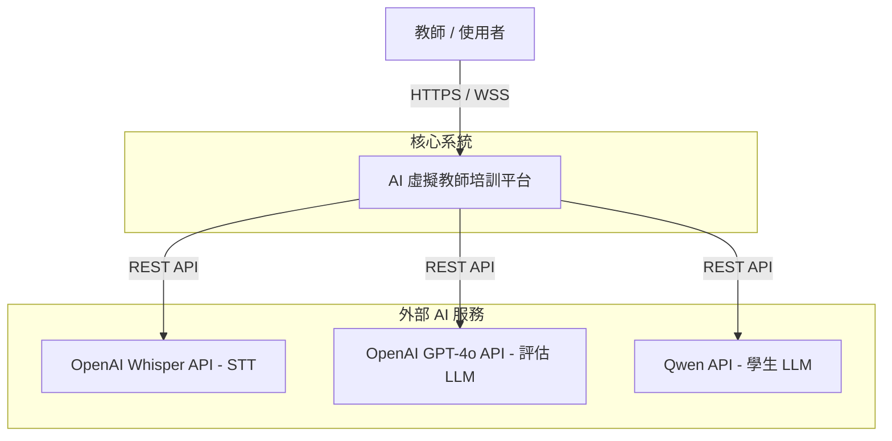
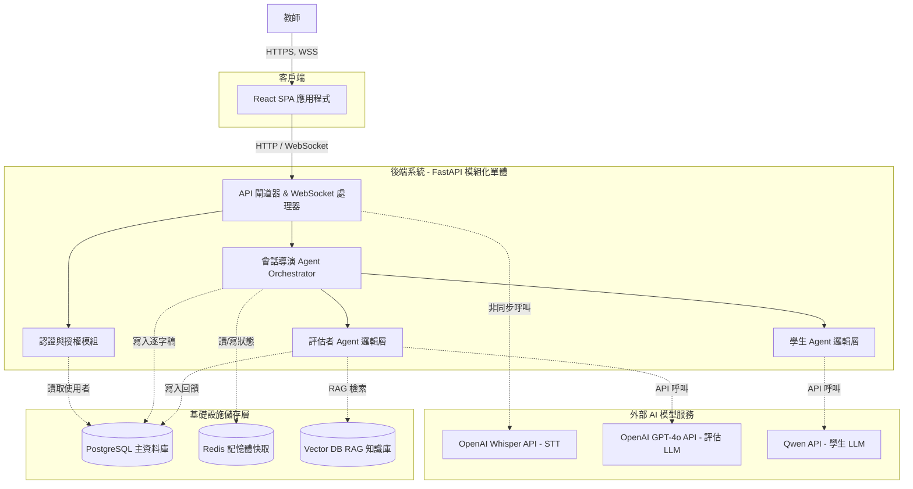

# 系統架構文件 (System Architecture)
**專案:** AI 虛擬教師培訓平台 (AI Virtual Teacher Training Platform)
**狀態:** 草稿 (Draft)
**版本:** 1.1
**日期:** 2026-02-28

## 1. 架構願景與原則 (Architectural Vision & Principles)

本系統依循 **FAANG 等級的可靠性與擴展性標準** 進行設計，核心採用 **模組化單體 (Modular Monolith)** 架構。這在專案初期能最大化交付速度，同時透過嚴格的領域驅動設計 (DDD) 邊界，確保未來無痛轉型為微服務。

在 AI 互動層，我們實作了 **中央導演 (Director Pattern) 治理的多代理人 (Multi-Agent) 架構**，這能確保對話的安全性、上下文連貫性，並防止 LLM 產生幻覺 (Hallucination) 導致對話失控。

## 2. C4 模型：高階視圖 (High-Level View)

*(註：已針對 Mermaid 8.8.0 語法進行相容性修正，移除 subgraph 內的 direction 屬性)*

### 2.1 層級 1：系統情境圖 (System Context)

### 2.2 層級 2：容器圖 (Container Diagram)

## 3. 核心資訊流 (Core Information Flows)

### 3.1 即時互動迴圈 (Interaction Loop - 低延遲優先)
1. **輸入:** Web 端擷取音訊 (WebRTC / MediaRecorder) 並透過 WebSocket 串流至後端。
2. **STT:** 後端非同步呼叫 Whisper 轉換為文字。
3. **路由與防護:** 傳入 `Session Director`，進行 Prompt Injection 防禦檢查，並提取對話歷史 (Redis)。
4. **生成:** `Student Agent` 附加 Persona 指令呼叫 Qwen 模型。
5. **輸出:** 回傳文字與情緒標籤，非同步觸發 TTS 服務，透過 WebSocket 推播回前端更新 UI 與播放音訊。

### 3.2 非同步評估迴圈 (Evaluation Loop - 高精準優先)
1. **觸發:** 教師主動結束，或系統偵測對話達上限。
2. **檢索 (RAG):** `Evaluator Agent` 分析整份逐字稿，萃取關鍵教學行為，並向 Vector DB 查詢相關的 Satir/SEL 理論。
3. **推理:** 將逐字稿與理論知識組合成 Prompt，交由 GPT-4o 進行深度推理。
4. **持久化:** 解析 JSON 結構的評分結果，寫入 PostgreSQL，並發送 Notification 給前端。

## 4. 可靠性與安全性架構 (Reliability & Security Posture)

*   **高可用性 (High Availability):** 後端 FastAPI 節點設計為**完全無狀態 (Stateless)**，所有會話狀態 (Session State) 皆儲存於 Redis。這允許後端透過 Kubernetes (HPA) 進行水平擴展。
*   **熔斷與重試機制 (Circuit Breaking & Retries):** 針對外部 AI API (OpenAI, Qwen)，實作指數退避 (Exponential Backoff) 的重試機制與斷路器，防止第三方服務不穩時拖垮內部系統。
*   **資料隔離 (Data Isolation):** PostgreSQL 採用 Row-Level Security (RLS) 邏輯概念設計，確保 API 層強制驗證 `user_id`，防止越權存取他人報告 (IDOR 漏洞防護)。