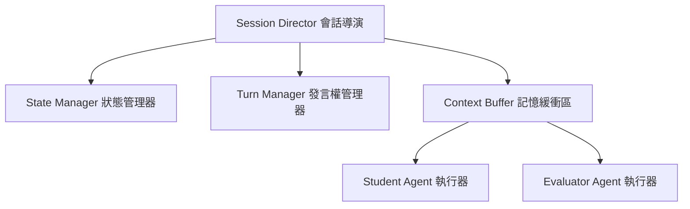
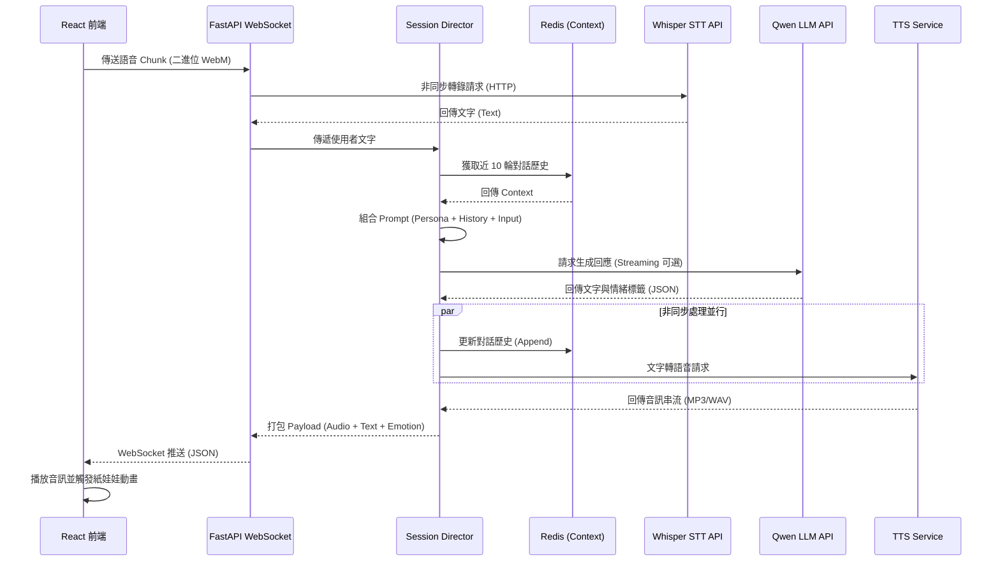

# 系統設計文件 (System Design)
**專案:** AI 虛擬教師培訓平台
**狀態:** 草稿 (Draft)
**版本:** 1.1
**日期:** 2026-02-28

## 1. 技術棧與選型理由 (Technology Stack)

| 領域 | 技術 | 選型理由 (FAANG 標準評估) |
|---|---|---|
| **前端** | React 18, TypeScript, Zustand | TypeScript 提供嚴格型別安全，降低 Runtime 錯誤。React 生態系對於處理複雜狀態與 Web Audio API 支援最為成熟。 |
| **後端** | FastAPI (Python 3.11+) | Python 是 AI/LLM 整合的業界標準。FastAPI 的 ASGI 非同步特性，完美契合大量 I/O 等待 (API 呼叫) 與 WebSocket 長連線場景。 |
| **AI 代理** | LangChain / LangGraph | 提供 Agentic Workflow 的標準化抽象，便於管理複雜的 Prompt Chain、工具調用 (Tool Calling) 與記憶體 (Memory)。 |
| **資料庫** | PostgreSQL 15+ | 支援 ACID 交易，確保資料一致性。其 `JSONB` 欄位型態非常適合儲存非結構化的 LLM 回饋報告。 |
| **快取/狀態**| Redis 7.x | 用於分散式鎖 (Distributed Locks)、Rate Limiting 以及維持低延遲的會話上下文 (Context Window)。 |

## 2. 整潔架構分層 (Clean Architecture Layering)

系統嚴格遵循依賴反轉原則 (Dependency Inversion Principle, DIP)：外層依賴內層，內層對外層一無所知。

1.  **介面層 (Presentation):** `routers/`, `websockets/`。處理 HTTP 請求、WebSocket 封包解析與 Pydantic 參數驗證。
2.  **應用層 (Application - Use Cases):** `services/`, `orchestrator/`。包含 `SessionDirector`。負責業務流程編排，例如：「接收音訊 -> 轉文字 -> 呼叫 Agent -> 儲存紀錄」。
3.  **領域層 (Domain):** `models/`, `entities/`。包含核心的業務規則，例如：「一場會話最多 20 輪對話」、「分數計算公式」。此層為純 Python，不依賴任何外部框架或 DB。
4.  **基礎設施層 (Infrastructure):** `repositories/`, `clients/`。實作領域層定義的介面 (Interface/Protocol)。包含 SQLAlchemy 的 DB 存取邏輯、Redis 連線、OpenAI/Qwen 的 API Client。

## 3. 核心元件設計：會話導演 (Session Director)

`Session Director` 是系統的心臟，採用狀態機 (State Machine) 概念確保流程可控。

## 4. 系統循序圖：即時對話流程 (Sequence Diagram)

此循序圖展示了 Path A（即時互動迴圈）的詳細內部運作機制，強調了非同步處理以降低延遲。

